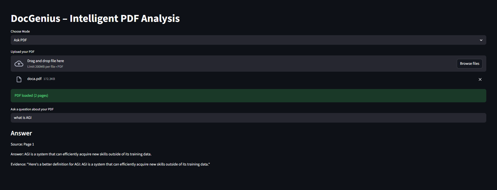
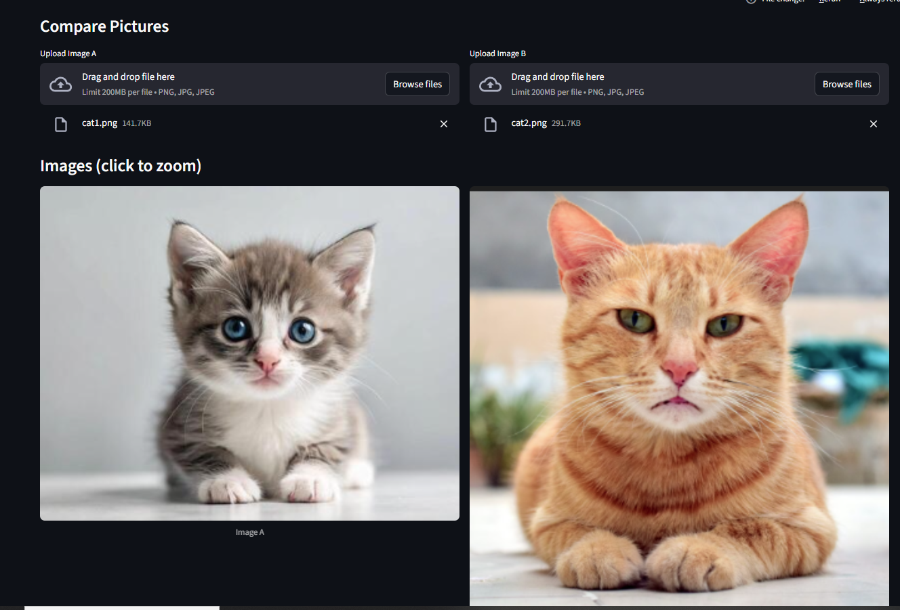
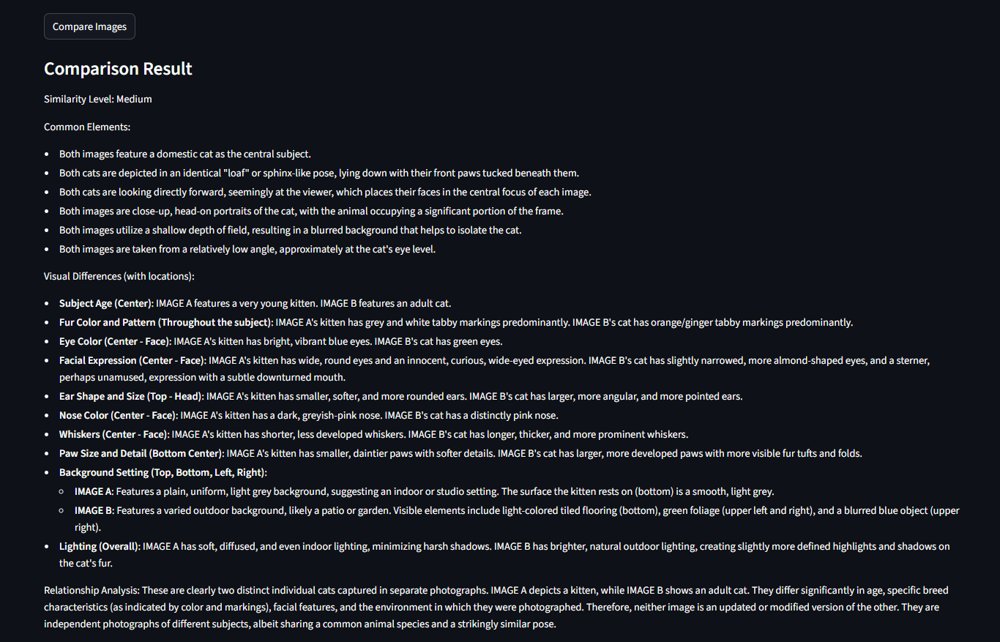

# DocGenius – Intelligent Document & Image Analysis 🧠📄🖼️

DocGenius is a Streamlit-based AI application that allows you to **analyze, compare, and reason about PDFs and images** using Google Gemini models.

It is designed to be **trust-focused**, **explainable**, and **human-friendly**, not just a chat tool.

---

## 🚀 Features

### 📄 Ask PDF
- Upload a PDF
- Ask questions about the document
- Answers include:
  - Exact **page number**
  - **Source paragraph** as evidence
- Prevents hallucination by answering only from the document

### 🔍 Compare PDFs
- Upload **two PDFs**
- Intelligent semantic comparison
- Detects:
  - Common points
  - Key differences
  - Relationship (evolution vs contradiction)
  - Similarity level (Low / Medium / High)
- Works even if wording is different (e.g. old CV vs new CV)

### 🖼️ Compare Pictures
- Upload **two images**
- View images **side-by-side**
- Click images to zoom
- AI analyzes:
  - Visual similarities
  - Visual differences with locations
  - Relationship between images
  - Overall similarity level

---

## 🧠 Why DocGenius is Different

- Focuses on **explainability and trust**
- Shows *why* an answer is correct
- Works with **documents + images**
- Designed like a **real product**, not a demo

---

## 🖼️ Screenshots

### Ask PDF – Page-Based Answers


### Compare PDFs – Semantic Comparison


### Compare Pictures – Visual Intelligence



---

## 🛠️ Tech Stack

- **Python**
- **Streamlit**
- **Google Gemini (google-genai)**
- **PyPDF**
- **Pillow**
- **python-dotenv**

---

## ⚙️ Installation

```bash
python -m venv venv
venv\Scripts\activate
pip install -r requirements.txt
streamlit run app.py

## 👤 Author
**Imran Khaliq**
